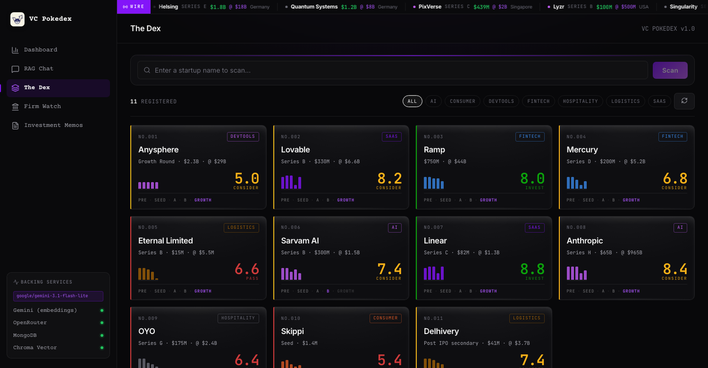
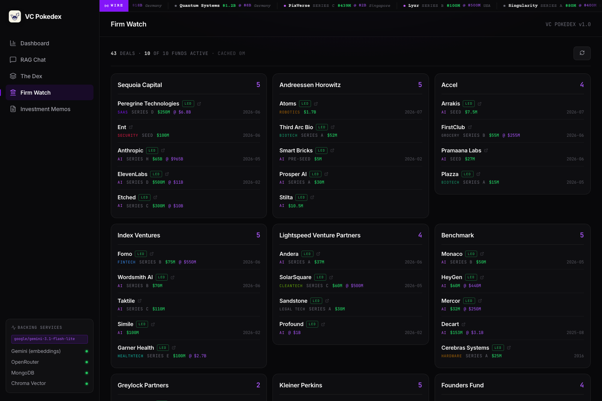
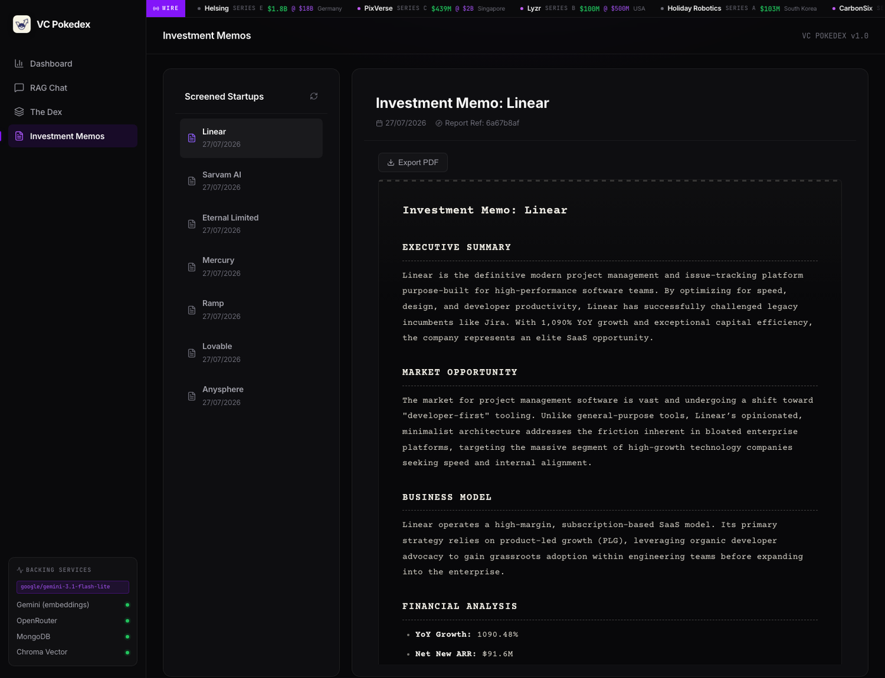

<div align="center">


# VC Pokedex

### Bloomberg for startup portfolios

Type a startup's name. Six agents research it on the open web, benchmark it against
**232 real SEC filings**, score it across five dimensions, and write an investment memo.

Entries accumulate as numbered Dex records.

<br />



</div>

---

## What it does

There is no upload step and no data entry. You type `Ramp`, and about twenty
seconds later you have a scored dossier: what it does, what it raised and at what
valuation, who founded it and what they shipped before, who it competes with,
what diligence would turn up, and a full Markdown memo.

| | |
|---|---|
| **Input** | a company name |
| **Output** | profile · funding · comparables · founders · competitors · risk · scorecard · memo |
| **Latency** | ~2s to acknowledge, ~18s to a complete entry |
| **Grounding** | live web research + 232 SEC Form D filings |

---

## Architecture

Six agents, five of them concurrent, orchestrated as a LangGraph `StateGraph`
with a corrective-RAG loop.

```
                        name  ──►  research_agent
                                   Tavily: product / funding / people /
                                   traction + a recency-biased news pass
                                          │  dossier
                                          ▼
                                   ┌─────────────┐
                                   │   profile   │  structured facts + funding
                                   └──────┬──────┘
              ┌───────────┬───────────┬───┴───────┬───────────┐
              ▼           ▼           ▼           ▼           ▼   (concurrent)
        ┌──────────┐┌──────────┐┌──────────┐┌──────────┐┌──────────┐
        │  comps   ││financials││ founders ││competitors││   risk   │
        │ SEC      ││ ratios + ││  track   ││ landscape ││ red flags│
        │ Form D   ││ judgment ││  record  ││  + moat   ││ from news│
        └────┬─────┘└────┬─────┘└────┬─────┘└─────┬─────┘└────┬─────┘
             └───────────┴───────────┴────────────┴───────────┘
                                   ▼
                          ┌─────────────────┐
                          │ grade_retrieval │  are these comps actually relevant?
                          └────────┬────────┘
                     irrelevant ───┴─── relevant
                          │                 │
                 ┌────────▼───────┐         ▼
                 │ rewrite_query  │    ┌────────┐   ┌────────┐
                 └────────┬───────┘    │ score  │──►│  memo  │──► END
                          │            └────────┘   └────────┘
                          └──► comps (max 2 rewrites)
```

### What each agent contributes

| Agent | Question it answers | Source |
|---|---|---|
| `profile` | What is this, what stage, what did it raise? | the dossier |
| `comps` | What did similar deals price at? | 232 SEC Form D filings, hybrid RAG |
| `financials` | Is the burn / growth / margin profile healthy? | deterministic ratios + judgment |
| `founders` | Who are these people, what have they shipped? | per-founder web search |
| `competitors` | Who else builds this, is there a moat? | market web search |
| `risk` | What would diligence turn up? | recent news |

> **Node contract.** Every node returns *only* the state keys it owns. Returning
> `{**state, ...}` makes all five concurrent nodes write every channel in the same
> superstep, and LangGraph rejects that with `InvalidUpdateError`. Regression tests
> live in `tests/test_orchestrator.py` — an import smoke test cannot catch it,
> because the graph has to actually run.

---

## Stack

| Layer | Choice |
|---|---|
| LLM | `google/gemini-3.1-flash-lite` via OpenRouter, failing over to Gemini direct |
| Embeddings | `gemini-embedding-001` (3072 dims) |
| Orchestration | LangGraph `StateGraph` — parallel fan-out + CRAG loop |
| Vector DB | ChromaDB `PersistentClient` + BM25, fused with Reciprocal Rank Fusion |
| Document DB | MongoDB (Motor async driver) |
| Web research | Tavily (multi-angle + news) |
| API | FastAPI, background jobs, SSE streaming |
| Frontend | Vite · React 19 · TypeScript · Recharts |

Model IDs are pinned exactly — no `latest` aliases, since providers hot-swap them.
`tests/test_agents.py::TestModelPins` fails the build if one appears.

> **Gemini's 2.5 generation is retired for new API keys.** `gemini-2.5-flash`
> returns `404 … no longer available to new users`, even though `models.list()`
> still advertises it. Verified working on a fresh key: `gemini-3.6-flash`,
> `gemini-3.5-flash`, `gemini-3-flash-preview`, `gemini-3.1-flash-lite`.

---

## Quick start

```bash
git clone <your-fork> vc-pokedex && cd vc-pokedex
cp .env.example .env          # add GEMINI_API_KEY + TAVILY_API_KEY

python -m venv venv && source venv/bin/activate
pip install -r requirements.txt
cd dashboard && npm install && npm run build && cd ..

docker compose up -d          # MongoDB + Mongo Express
python seed_edgar.py          # 232 real comps from SEC Form D
uvicorn api.main:app --port 8000
```

Open **http://localhost:8000**. The API serves the built dashboard; you only need
Vite (`cd dashboard && npm run dev`) when editing frontend code.

### Keys

| Variable | Required | Free at |
|---|---|---|
| `GEMINI_API_KEY` | **yes** — embeddings run on Gemini regardless of chain | [aistudio.google.com](https://aistudio.google.com/) |
| `TAVILY_API_KEY` | **yes** — all research runs on it | [tavily.com](https://tavily.com) |
| `OPENROUTER_API_KEY` | recommended | [openrouter.ai/keys](https://openrouter.ai/keys) |

OpenRouter legs are skipped automatically when the key is absent, so the default
config runs on Gemini alone.

---

## The provider chain

Generation walks an ordered chain that spans vendors. Entries are
provider-qualified; unqualified means Gemini direct.

```
openrouter:google/gemini-3.1-flash-lite            ← primary
openrouter:nvidia/nemotron-3-super-120b-a12b:free  ← free net if credits run out
openrouter:openai/gpt-oss-20b:free
openrouter:openrouter/free
gemini-3.6-flash → gemini-3.1-flash-lite → gemini-3-flash-preview → gemini-3.5-flash
```

A `429` (Gemini) or `402` (OpenRouter's response to a spent free-tier day)
advances to the next leg. Any other error fails immediately rather than burning
the chain.

### Free-tier limits, all of them real

| Metric | Cap | Handling |
|---|---|---|
| `generate_content` | 5/min **per model** | sliding-window pacing |
| `generate_content` | **20/day per model** | failover multiplies the budget across models |
| `embed_content` | 100/min, metered **per input item** | item-level pacing |

Set `GENERATE_REQUESTS_PER_MINUTE=0` and `EMBED_ITEMS_PER_MINUTE=0` to disable
pacing on a paid plan.

---

## Features

**Firm Watch** — recent investments by ten of the largest global funds, with a
`LED` badge separating rounds a firm led from ones it merely joined.



**Investment memos** — set in a typewriter face, exported to PDF through the
browser's print pipeline: real selectable text, working page breaks, no bundle cost.



Also: a live funding **wire** across the top, **RAG chat** grounded on any scanned
dossier, recent **news** per company, and founder names linking out to their
search results.

---

## The comps corpus

`comps` doesn't retrieve from a synthetic list. It searches **232 real SEC Form D
filings** — the notice filed for essentially every US private round.

Getting there required filtering: of 15,735 filings in 2026Q1, **10,135 are
`Pooled Investment Fund`** — the VC funds themselves. Those plus real-estate and
oil-and-gas vehicles are excluded by allowlist, leaving ~1,485 genuine venture
rounds per quarter.

Form D gives issuer, sector, location, year, **actual amount raised**, revenue
band and related persons. It does **not** give ARR, burn or headcount — those
aren't public at scale for private companies. Stage is *inferred* from round size
and labelled as inferred. See [SEEDING.md](SEEDING.md).

### Retrieval

Two deliberately separate ChromaDB collections:

- `vc_comps` — the Form D benchmark corpus
- `vc_documents` — dossiers of scanned companies

Mixing them means a scanned company returns as its own "comparable deal."

Each query runs a dense leg (Gemini embeddings) and a sparse leg (BM25), fuses
them with RRF, then **re-orders the fetched rows by RRF rank** — Chroma's
`get(ids=…)` returns rows in its own internal order, so reading them back
directly discards the ranking entirely.

---

## API

| Method | Path | Purpose |
|---|---|---|
| `POST` | `/research` | **Scan a company by name.** Returns `202`; analysis runs in the background. |
| `GET` | `/research/status/{file_id}` | Poll a scan: `processing` / `complete` / `failed` |
| `GET` | `/research/documents` | Every Dex entry, including in-flight scans |
| `DELETE` | `/research/documents/{doc_id}` | Remove an entry, its chunks, deal and memo |
| `GET` | `/research/ticker` | Recent global raises (3h cache) |
| `GET` | `/research/firms` | Top-fund activity (6h cache) |
| `GET` | `/reports/deals` | Deal list with filtering and pagination |
| `GET` | `/reports/deals/{id}` | Full scorecard, ratios, founders, competitors |
| `GET` | `/reports/deals/{id}/memo` | The investment memo |
| `GET` | `/reports/deals/{id}/news` | Recent coverage |
| `GET` | `/reports/trends` | Sector / stage / monthly aggregates |
| `POST` | `/chat` · `/chat/stream` | RAG chat, optionally scoped to one dossier |
| `GET` | `/health` | Service status — never calls the LLM |

Interactive docs at `/docs`.

---

## Financial ratios

`tools/calculator.py` is pure Python and never calls an LLM.

| Metric | Formula |
|---|---|
| `burn_multiple` | (monthly burn × 12) ÷ net new ARR |
| `runway_months` | cash ÷ monthly burn |
| `yoy_growth` | (ARR − prev ARR) ÷ prev ARR × 100 |
| `gross_margin` | (revenue − COGS) ÷ revenue × 100 |
| `arr_per_head` | ARR ÷ headcount |

Burn is annualized before the burn-multiple division so both sides cover the same
period — comparing monthly burn to an annual ARR delta understates it ~12×.

Inputs parse leniently: `"$5M"`, `"1.2 bn"`, `"750K"`, `"78%"` and `"(500,000)"`
all resolve. Any metric whose inputs are missing or degenerate returns `None`
rather than a guess.

---

## Testing

```bash
pytest -q                        # 104 tests, no network calls
cd dashboard && npm run build    # tsc + vite
```

The Gemini SDK is faked at the client boundary (`tests/conftest.py`), so prompt
construction, JSON parsing and graph wiring are all exercised for real while the
suite stays offline and fast.

---

## Design notes

Dark, near-black surfaces with a violet accent; Inter for interface, JetBrains
Mono for data, Courier Prime for documents.

**Chart colour is validated, not chosen by eye.** The categorical order in
`dashboard/src/theme.ts` is the colourblind-safety mechanism, checked against the
dark chart surface: adjacent-pair CVD ΔE 9.4, normal-vision ΔE 19.3, all slots
≥ 3:1 contrast. It passes all-pairs for the **first four slots only**, so the
sector donut caps at four hues and folds the rest into a neutral *Other*.

Single-series charts use one colour — the axis already carries identity, so a
per-category rainbow would be decoration rather than encoding.

---

## Security

- `CORS_ORIGINS` must list explicit origins. With credentials enabled, Starlette
  echoes the caller's `Origin` rather than sending `*`, so a wildcard lets any
  site issue credentialed cross-origin requests.
- The SPA catch-all resolves static files inside `dist` only, with a traversal
  guard verified against `../`, `%2f` and `%2e%2e` encodings.
- `.env`, `.env.*` and `*.bak` are gitignored — API keys never reach the repo.

---

## Project layout

```
agents/       LangGraph nodes — one file per agent, plus orchestrator.py
tools/        LLM client, providers, vector store, Mongo, calculator, search, EDGAR
api/          FastAPI app, schemas, routes
pipelines/    Research and analysis orchestration
dashboard/    Vite + React SPA
tests/        pytest suite
seed_edgar.py Real comps from SEC Form D
seed_comps.py Synthetic fallback for offline demos
```

## License

MIT — see [LICENSE](LICENSE).
